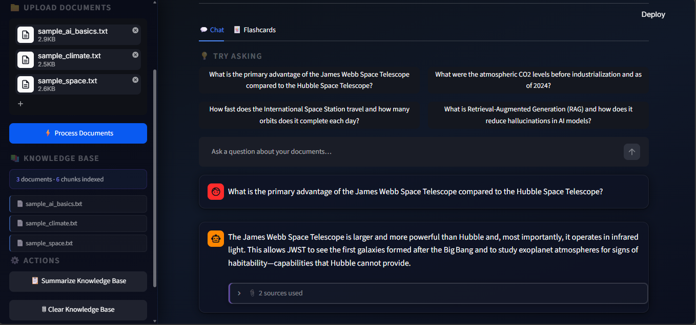
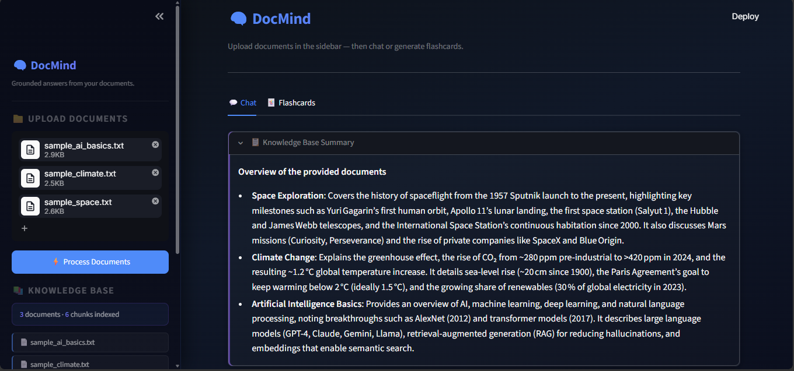
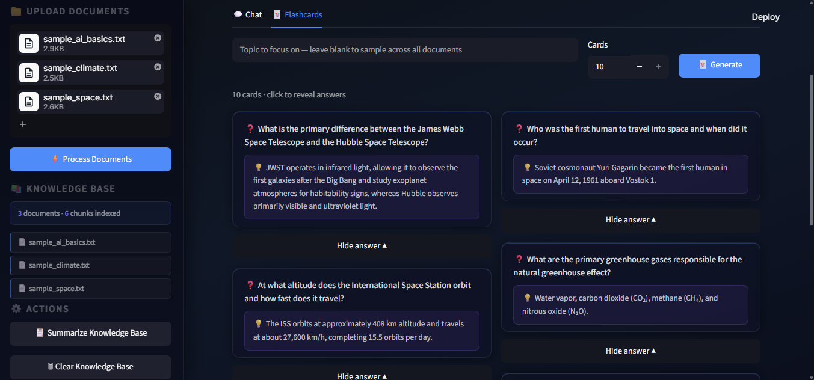

# DocMind

A local RAG (Retrieval-Augmented Generation) chatbot that answers questions **only from the documents you upload** — every answer is grounded in your content and cites its source.

| Chat + suggested questions | Knowledge base summary | Flashcards |
|---|---|---|
|  |  |  |

---

## Features

- **Grounded chat** — answers pulled exclusively from uploaded PDFs and TXT files, with source citations
- **Knowledge base summary** — one-click overview of everything in your knowledge base
- **Suggested starter questions** — auto-generated from your documents on first load
- **Flashcards** — study cards generated from your content, with flip animation
- **Persistent storage** — ChromaDB keeps your knowledge base between sessions
- **Runs locally** — embeddings computed on CPU, no GPU required; only retrieved text snippets are sent to Groq

---

## How it works

```
Upload PDF/TXT → Extract text → Chunk (~400 words, 50-word overlap)
    → Embed locally (BAAI/bge-small-en-v1.5) → Store in ChromaDB

User question → Embed query → Retrieve top-4 chunks → Build grounded prompt
    → Stream answer via Groq (openai/gpt-oss-20b) → Show answer + sources
```

---

## Stack

| Layer | Tool |
|---|---|
| UI | Streamlit |
| Embeddings | `BAAI/bge-small-en-v1.5` — sentence-transformers, local CPU |
| Vector store | ChromaDB (persistent) |
| Generation | Groq API — `openai/gpt-oss-20b`, streaming |

---

## Project structure

```
docmind-rag-chatbot/
├── app.py              # Streamlit UI — sidebar, chat tab, flashcards tab
├── ingest.py           # Upload → chunk → embed → ChromaDB
├── retrieval.py        # Semantic search with BGE query prefix
├── generation.py       # Groq streaming with grounded system prompt
├── flashcards.py       # Flashcard generation (JSON structured output)
├── summaries.py        # KB summary + suggested starter questions
├── tests/
│   ├── test_chunking.py
│   └── test_retrieval.py
├── data/               # Sample documents for testing
├── assets/             # Screenshots for README
├── .streamlit/
│   └── config.toml     # Dark theme
├── requirements.txt
├── .env.example
└── .gitignore
```

---

## Setup

**1. Clone the repo**
```bash
git clone https://github.com/khusheengoyal/docmind-rag-chatbot.git
cd docmind-rag-chatbot
```

**2. Create a virtual environment (Python 3.12)**
```bash
py -3.12 -m venv .venv
.venv\Scripts\Activate.ps1      # Windows PowerShell
# source .venv/bin/activate     # macOS / Linux
```

**3. Install dependencies**
```bash
pip install -r requirements.txt
```

> On first run, sentence-transformers downloads `BAAI/bge-small-en-v1.5` (~130 MB) once to your local cache.

**4. Add your Groq API key**
```bash
copy .env.example .env
```
Edit `.env` and paste your key (`GROQ_API_KEY=...`). Get a free key at [console.groq.com](https://console.groq.com).

**5. Run**
```bash
streamlit run app.py
```

---

## Try it with sample documents

Three sample files are included in `/data`:

| File | Topic |
|---|---|
| `sample_ai_basics.txt` | AI, ML, RAG, embeddings |
| `sample_climate.txt` | Climate science, Paris Agreement |
| `sample_space.txt` | Space exploration history |

Upload one or more, click **Process Documents**, then ask questions or generate flashcards.

---

## Tests

```bash
pytest tests/ -v
```

Requires at least one document already ingested (run the app and process a file first).
